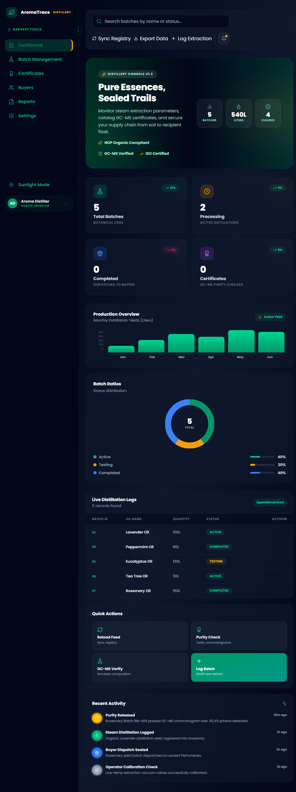
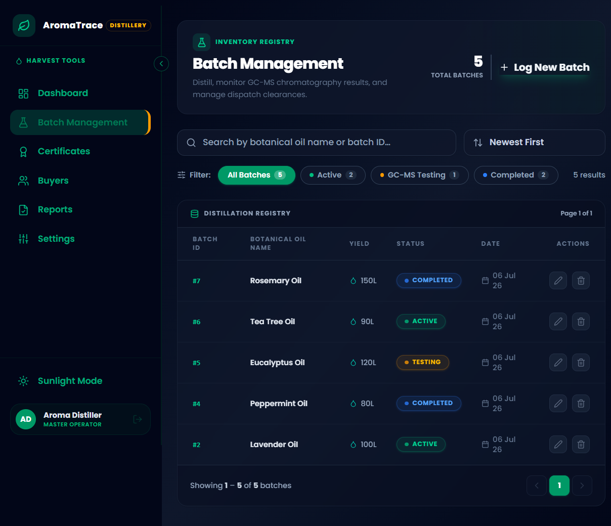

# 🌿 AromaTrace

## 🚀 Overview

AromaTrace is a modern full-stack application designed to simplify essential oil batch management with secure JWT authentication, production tracking, and an intuitive SaaS dashboard. Users can create, update, delete, search, and monitor production batches through a responsive React frontend backed by an Express.js REST API and a PostgreSQL database managed with Prisma ORM.

---

## ✨ Features

- 🌿 Premium SaaS Landing Page
- 📊 Analytics Dashboard
- 📦 Batch Management
- ➕ Create Batch
- ✏️ Edit Batch
- ❌ Delete Batch
- 🔍 Search & Filter
- 📈 Production Statistics
- 🌙 Dark Mode
- 📱 Fully Responsive
- ⚡ Glassmorphism UI
- 🎨 Framer Motion Animations
- 🗄 PostgreSQL Database (Supabase)
- 🔐 JWT Authentication
- 👤 User Registration
- 🔑 User Login
- 🛡 Protected Routes
- 🔒 Password Hashing (bcrypt)
- 🌐 Google OAuth (Mock)
- 🔐 REST API using Express & Prisma


## 🔐 Authentication

AromaTrace includes a secure authentication system with:

- User Registration
- User Login
- JWT-based Authentication
- Password Hashing using bcrypt
- Protected Routes
- Google OAuth (Mock)
- Authenticated User Profile Endpoint

---

## 🛠 Tech Stack

---

### Frontend

- React
- Vite
- Tailwind CSS
- Framer Motion
- React Router
- Lucide React

### Backend

- Node.js
- Express.js
- Prisma ORM
- PostgreSQL
- Supabase
- JWT Authentication
- bcryptjs
- Passport.js


## 🗄 Database Choice

AromaTrace uses **PostgreSQL** hosted on **Supabase**.

PostgreSQL was selected because it provides a structured relational database with ACID compliance, making it ideal for managing production batches, quantities, statuses, and timestamps. Prisma ORM simplifies database access while maintaining type safety and improving developer productivity.

## 📊 Database Schema


---

## 📂 Project Structure

```
aromatrace/
│
├── frontend/src/
|    │
|    ├── api/
|    ├── components/
├    |── context/
├    |── pages/
│
├── backend/
│   |
|   ├── config/
|   |── controllers/
|   |── middleware/
|   |── prisma/
|   |── routes/
```

---

## 📌 REST API

| Method | Endpoint | Description |
|---------|----------|-------------|
| POST | /api/auth/register | Register new user |
| POST | /api/auth/login | User login |
| GET | /api/auth/me | Get authenticated user |
| GET | /api/auth/google | Google OAuth Login |
| GET | /api/batches | Get all batches |
| GET | /api/batches/:id | Get single batch |
| POST | /api/batches | Create batch |
| PUT | /api/batches/:id | Update batch |
| DELETE | /api/batches/:id | Delete batch |
| GET | /api/batches/search/:name | Search batches |

---

## 🚀 Installation

### Clone Repository

```bash
git clone https://github.com/ojasjais/AromaTrace.git
cd AromaTrace
```

### Install Frontend

```bash
cd frontend
npm install
npm run dev
```

### Install Backend

```bash
cd ../backend
npm install
npm run dev
```

---

## 🔑 Environment Variables

Backend `.env`

```env
PORT=5000
DATABASE_URL=your_database_url
DIRECT_URL=your_direct_database_url
JWT_SECRET=your_secret_key
JWT_EXPIRES_IN=7d

FRONTEND_URL=http://localhost:5173

GOOGLE_CLIENT_ID=your_google_client_id
GOOGLE_CLIENT_SECRET=your_google_client_secret
GOOGLE_CALLBACK_URL=http://localhost:5000/api/auth/google/callback

```

Frontend `.env`

```env
VITE_API_URL=http://localhost:5000/api
```

---

## 📸 Screenshots

### 🏠 Home


### 📊 Dashboard



### 📦 Batch Management



## 🔐 Authentication

### User Registration


### User Login


---

## ☁️ Deployment

- **Frontend:** Vercel
- **Backend:** Render
- **Database:** Supabase PostgreSQL

## 🌐 Live Demo

- **Frontend:** https://aroma-trace.vercel.app
- **Backend API:** https://aromatrace.onrender.com

---

## 👨‍💻 Author

Ojasvi Jaiswal

GitHub:
https://github.com/ojasjais

LinkedIn:
https://www.linkedin.com/in/ojasvijaiswal

---

## 📄 License

This project is developed for educational purposes as part of the Graphic Era University AI-Assisted Full Stack Web Development Internship.
