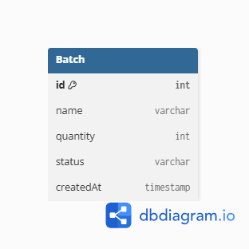
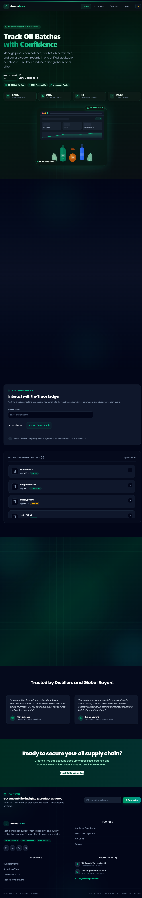

# 🌿 AromaTrace

AromaTrace is a Full Stack Web Application developed to manage essential oil production batches efficiently. The application enables users to create, view, update, delete, and search production batches through a clean React frontend and a RESTful Express.js backend. Data is stored persistently in a PostgreSQL database hosted on Supabase and managed using Prisma ORM.

---

## 🚀 Features

* Create new production batches
* View all available batches
* View a single batch by ID
* Update batch information
* Delete existing batches
* Search batches by name
* PostgreSQL database integration using Supabase
* Prisma ORM for database operations
* Responsive React frontend
* RESTful API architecture

---

## 🛠 Tech Stack

## 📂 Project Structure

```text
AromaTrace/
│
├── backend/
│   ├── prisma/
│   ├── server.js
│   ├── package.json
│   └── ...
│
├── frontend/
│   ├── src/
│   ├── public/
│   ├── package.json
│   └── ...
│
├── images/
│   └── schema-diagram.png
│
├── README.md
└── .gitignore
```

### Frontend

* React.js
* React Router
* Axios
* Tailwind CSS

### Backend

* Node.js
* Express.js
* Prisma ORM

### Database

* PostgreSQL (Supabase)

### Tools

* Postman
* Git & GitHub
* VS Code

---

## 🗄 Database Choice

PostgreSQL was chosen because the project contains structured data with predefined fields such as batch name, quantity, status, and creation date. PostgreSQL provides strong consistency, reliability, and efficient querying, making it suitable for production management applications.

---

## 📊 Database Schema



---

## 📌 REST API Endpoints

| Method | Endpoint                    | Description            |
| ------ | --------------------------- | ---------------------- |
| GET    | `/api/batches`              | Get all batches        |
| GET    | `/api/batches/:id`          | Get a single batch     |
| POST   | `/api/batches`              | Create a batch         |
| PUT    | `/api/batches/:id`          | Update a batch         |
| DELETE | `/api/batches/:id`          | Delete a batch         |
| GET    | `/api/batches/search/:name` | Search batches by name |

---

## ⚙️ Installation

### Clone the repository

```bash
git clone https://github.com/ojasjais/AromaTrace.git
```

### Install Frontend

```bash
cd frontend
npm install
npm run dev
```

### Install Backend

```bash
cd backend
npm install
npx prisma migrate dev
npm run dev
```

### Configure Environment Variables

```env
DATABASE_URL=your_database_url
DIRECT_URL=your_direct_database_url
PORT=5000
```

### Start Backend

```bash
npm run dev
```

### Start Frontend

```bash
npm run dev
```

---

## 📷 Project Screenshots

### Home Page



### Batch List


### Create Batch


### Update Batch


### Delete Batch


---

## 🔮 Future Improvements

* JWT Authentication
* User Roles (Admin/User)
* Dashboard Analytics
* Image Upload for Batches
* Batch History Tracking
* Pagination & Filtering
* Export Reports (PDF/Excel)

---

## 👨‍💻 Author

**Ojasvi Jaiswal**

GitHub: https://github.com/ojasjais

---

## 📜 License

This project was developed as part of the **AI-Assisted Full Stack Web Development Internship**.
