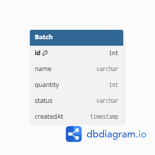
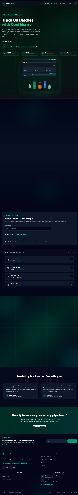
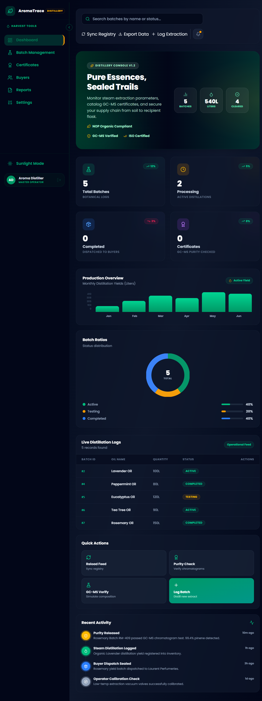
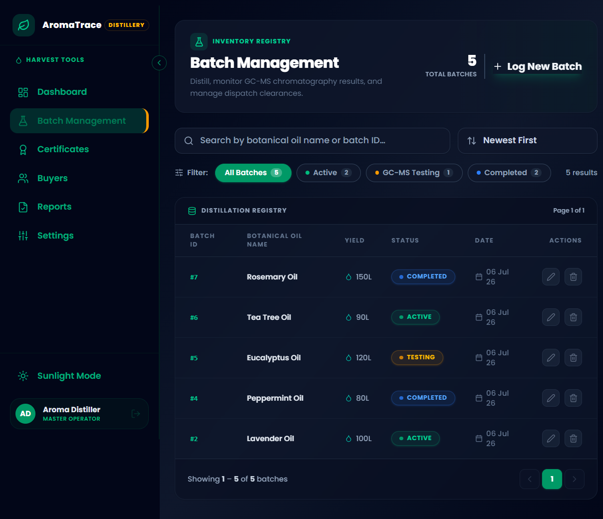
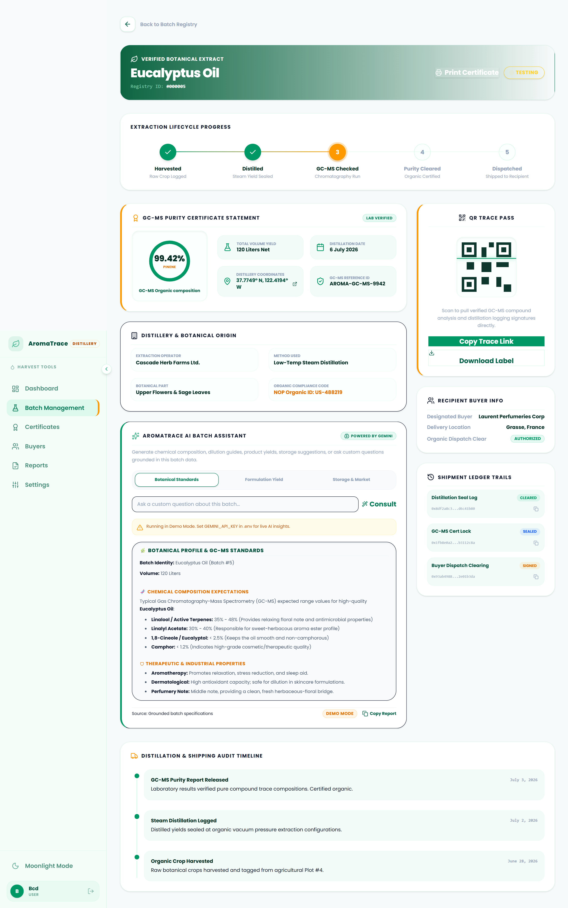
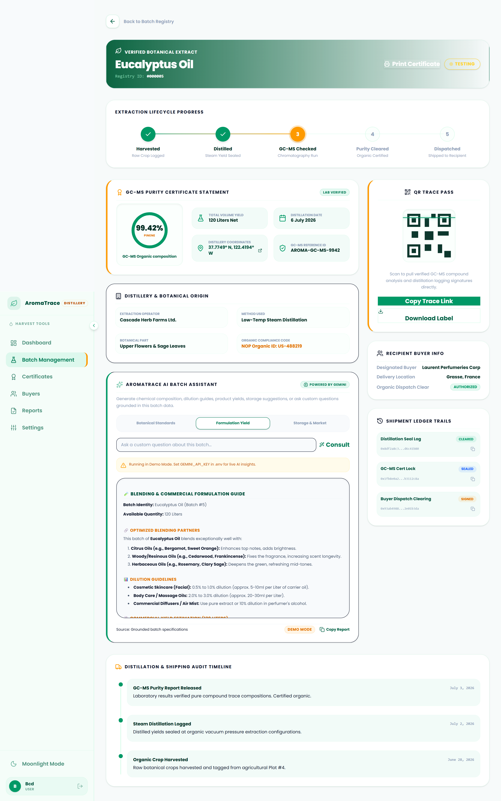
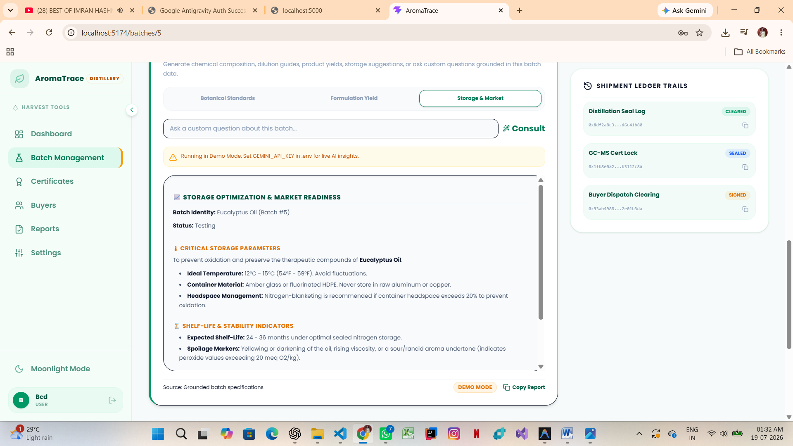
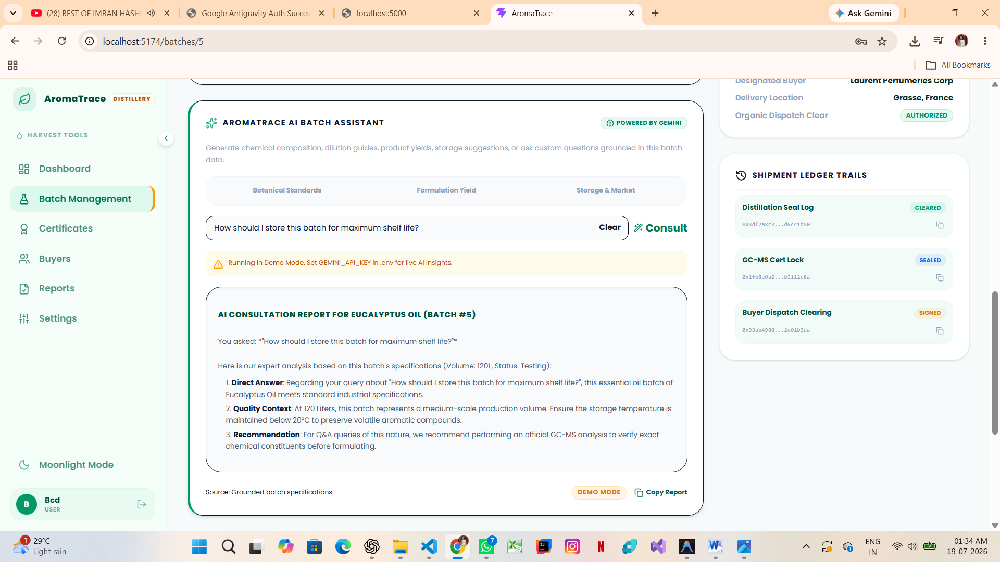

# 🌿 AromaTrace

## 🚀 Overview

AromaTrace is a modern full-stack application designed to simplify essential oil batch management with secure JWT authentication, production tracking, and an intuitive SaaS dashboard. Users can create, update, delete, search, and monitor production batches through a responsive React frontend backed by an Express.js REST API and a PostgreSQL database managed with Prisma ORM.

---
**Version:** 1.0.0  
**Status:** ✅ Production Ready

## ✨ Features

- 🌿 Premium SaaS Landing Page
- 📊 Analytics Dashboard
- 📦 Batch Management
- ➕ Create Batch
- ✏️ Edit Batch
- ❌ Delete Batch
- 🔍 Search & Filter
- 📈 Production Statistics
- 🌙 Dark Mode
- 📱 Fully Responsive
- ⚡ Glassmorphism UI
- 🎨 Framer Motion Animations
- 🗄 PostgreSQL Database (Supabase)
- 🔐 JWT Authentication
- 👤 User Registration
- 🔑 User Login
- 🛡 Protected Routes
- 🔒 Password Hashing (bcrypt)
- 🌐 Google OAuth 2.0
- 🔐 REST API using Express & Prisma
- 🤖 AI Batch Insights (Google Gemini)
- 🌿 Botanical Profile Analysis
- 🧪 Formulation & Commercial Yield Recommendations
- 📦 Storage Optimization & Market Readiness
- ❓ Custom AI Batch Questions
- ⏳ AI Loading States & Error Handling

## 🚀 Production Features

- Public Cloud Deployment
- Google OAuth 2.0 Authentication
- Environment Variable Configuration
- Secure REST API
- Production Build Optimization
- CORS Configuration
- Render + Vercel Integration

## 🔐 Authentication

AromaTrace includes a secure authentication system with:

- Email & Password Authentication
- Google OAuth 2.0 Login
- JWT Authentication
- Protected Routes
- Persistent Login Sessions

---

## 🤖 AI Integration

AromaTrace integrates Google Gemini AI to generate intelligent insights for essential oil batches.

Available analysis modes:

- Botanical Profile
- Formulation & Commercial Yield
- Storage Optimization & Market Readiness
- Custom Batch Questions

The backend securely communicates with Gemini using environment variables, ensuring API keys are never exposed to the frontend.

## 📝 Prompt Engineering

Three prompt variations were designed, tested, and evaluated for the AI insights engine.

The repository includes:

- Prompt Variation 1 – Botanical Profile
- Prompt Variation 2 – Formulation & Commercial Yield
- Prompt Variation 3 – Storage Optimization

Complete prompt templates, example inputs, example outputs, evaluation, and analysis are documented in **PROMPTS.md**.

## 🛠 Tech Stack

### Frontend

- React
- Vite
- Tailwind CSS
- React Router

### Backend

- Node.js
- Express.js
- Prisma ORM
- PostgreSQL
- Supabase
- JWT Authentication
- bcryptjs
- Passport.js

### AI

- Google Gemini API
- Prompt Engineering


## 🗄 Database Choice

AromaTrace uses **PostgreSQL** hosted on **Supabase**.

PostgreSQL was selected because it provides a structured relational database with ACID compliance, making it ideal for managing production batches, quantities, statuses, and timestamps. Prisma ORM simplifies database access while maintaining type safety and improving developer productivity.

## 📊 Database Schema



---

## 📂 Project Structure

```
aromatrace/
│
├── frontend/src/
|    │
|    ├── api/
|    ├── components/
├    |── context/
├    |── pages/
│
├── backend/
│   |
|   ├── config/
|   |── controllers/
|   |── middleware/
|   |── prisma/
|   |── routes/
```
> The project is organized into separate frontend and backend applications for easier development, deployment, and maintenance.
---

## 📌 REST API

| Method | Endpoint | Description |
|---------|----------|-------------|
| POST | /api/auth/register | Register new user |
| POST | /api/auth/login  | User login |
| GET  | /api/auth/me  | Get authenticated user |
| GET  | /api/auth/google | Google OAuth Login |
| GET  | /api/batches | Get all batches |
| GET  | /api/batches/:id | Get single batch |
| POST | /api/batches | Create batch |
| PUT  | /api/batches/:id | Update batch |
| DELETE | /api/batches/:id | Delete batch |
| GET  | /api/batches/search/:name | Search batches |
| POST |/api/ai/insights |Generate AI-powered batch insights |

---

## 🚀 Installation

### Clone Repository

```bash
git clone https://github.com/ojasjais/AromaTrace.git
cd AromaTrace
```

### Install Frontend

```bash
cd frontend
npm install
npm run dev
```

### Install Backend

```bash
cd ../backend
npm install
npm run dev
```
---
   
## Build for Production

Frontend

```bash
npm run build
```

Backend

```bash
npm start
```
---

## 🔑 Environment Variables

Backend `.env`

```env
PORT=5000
DATABASE_URL=your_database_url
DIRECT_URL=your_direct_database_url
JWT_SECRET=your_secret_key
JWT_EXPIRES_IN=7d

FRONTEND_URL=http://localhost:5173

GOOGLE_CLIENT_ID=your_google_client_id
GOOGLE_CLIENT_SECRET=your_google_client_secret
GOOGLE_CALLBACK_URL=http://localhost:5000/api/auth/google/callback
GEMINI_API_KEY=your_gemini_api_key_here

```

Frontend `.env`

```env
VITE_API_URL=http://localhost:5000/api

```

### Production

Backend

```env
FRONTEND_URL=https://aroma-trace.vercel.app
GOOGLE_CALLBACK_URL=https://aromatrace-ezwn.onrender.com/api/auth/google/callback
```

Frontend

```env
VITE_API_URL=https://aromatrace-ezwn.onrender.com/api
```

## 🔒 Security & Production Readiness (Week 8)

- **Zero ESLint & TypeScript Warnings/Errors:** Clean production codebase audited and verified.
- **Production Build Verification:** Optimized bundle size with Vite and production asset chunking.
- **JWT Authentication & Bcrypt Password Hashing:** Secure authentication flow and protected API routes.
- **Input Validation:** Strict schema validation using Zod for API request payloads.
- **AI Rate Limiting:** Endpoint protection with `express-rate-limit` for Gemini AI calls.
- **Environment Security:** Secure environment variable management and CORS protection.
- **End-to-End API Validation:** Verified REST endpoints for Auth, Batches, Products, and AI Insights.

---

## 📸 Screenshots

### 🏠 Home



### 📊 Dashboard



### 📦 Batch Management



## 🔐 Authentication

### User Registration


### User Login


## 🤖 AI Insights

### Botanical Analysis



### Formulation Guide



### Storage Optimization



### Custom Query



### Google OAuth Login


---

## ☁️ Deployment

| Service | Platform |
|----------|----------|
| Frontend | Vercel |
| Backend | Render |
| Database | Supabase PostgreSQL |
| Authentication | JWT + Google OAuth 2.0 |
| AI | Google Gemini API |

## 🌐 Live Demo

### Live Frontend

https://aroma-trace.vercel.app

### Live Backend API

https://aromatrace-ezwn.onrender.com

---

## ⚠️ Known Limitations

- Render free tier automatically spins down after periods of inactivity.
- The first backend request after inactivity may take 30–60 seconds while the server wakes up.
- Google OAuth requires an active internet connection and a valid Google account.

## 👨‍💻 Author

Ojasvi Jaiswal

GitHub:
https://github.com/ojasjais

LinkedIn:
https://www.linkedin.com/in/ojasvijaiswal

---

## 📄 License

This project is developed for educational purposes as part of the Graphic Era University AI-Assisted Full Stack Web Development Internship.
